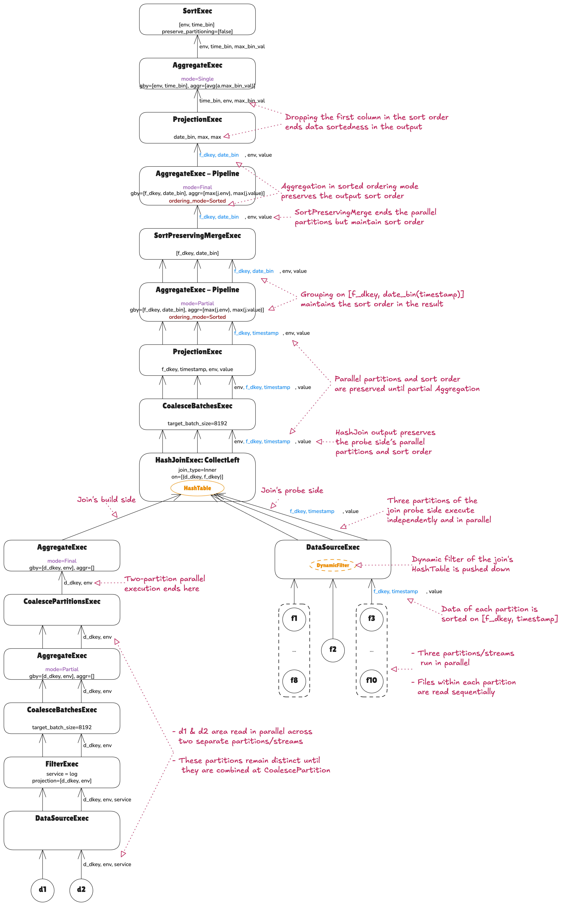

# plan-viz


[](https://www.typescriptlang.org/)
[](https://nodejs.org/)
[](LICENSE)
[](https://google.github.io/styleguide/tsguide.html)
[](https://github.com/NGA-TRAN/plan_viz/actions/workflows/ci-cd.yml)


Convert Apache DataFusion physical execution plans into **Excalidraw‑JSON** for clear visualization and deeper understanding. The generated diagrams use color coding to highlight key properties and propagate them throughout the plan, making it easy to see how many streams or partitions run in parallel at each operator and whether sort order is preserved and leveraged. The visualization also pinpoints operators where parallelism or sort order is lost, helping you quickly identify bottlenecks and guide performance improvements.

**Additional advantages of using Excalidraw:**
- Edit or extend the graphical plan directly in Excalidraw, then re‑save it back to JSON
- Export the visualization to PNG or SVG for sharing in documentation, presentations, or reports
- Collaborate interactively: Excalidraw supports real‑time editing, so teams can review and annotate plans together
- Layer annotations or styling to emphasize specific operators, execution paths, or performance concerns
- Maintain a living artifact: Excalidraw files can serve as both a visualization and editable source of truth

> **Repository**: [GitHub](https://github.com/NGA-TRAN/plan_viz) | **Issues**: [Report a bug](https://github.com/NGA-TRAN/plan_viz/issues)

<!-- ## Features

- 📊 Parse Apache DataFusion Physical Execution Plans
- 🎨 Generate Excalidraw-compatible JSON diagrams
- 🔧 Use as a library or CLI tool
- ✅ TypeScript support with full type definitions
- 🧪 Comprehensive test coverage (>95%)
- 🏗️ Built with Clean Code and SOLID principles
- ⚡ Fast and lightweight -->

## Example

### Input:

An indented EXPLAIN. You may also provide SQL or just the plan; the function automatically extracts physical operators.

  ```SQL
  | physical_plan | SortExec: expr=[env@0 ASC NULLS LAST, time_bin@1 ASC NULLS LAST], preserve_partitioning=[false]                                                                                                                                                                                                                                                                                                                                                                                            |
  |               |   AggregateExec: mode=Single, gby=[env@1 as env, time_bin@0 as time_bin], aggr=[avg(a.max_bin_val)]                                                                                                                                                                                                                                                                                                                                                                                        |
  |               |     ProjectionExec: expr=[date_bin(IntervalMonthDayNano("IntervalMonthDayNano { months: 0, days: 0, nanoseconds: 30000000000 }"),j.timestamp)@1 as time_bin, max(j.env)@2 as env, max(j.value)@3 as max_bin_val]                                                                                                                                                                                                                                                                           |
  |               |       AggregateExec: mode=Final, gby=[f_dkey@0 as f_dkey, date_bin(IntervalMonthDayNano("IntervalMonthDayNano { months: 0, days: 0, nanoseconds: 30000000000 }"),j.timestamp)@1 as date_bin(IntervalMonthDayNano("IntervalMonthDayNano { months: 0, days: 0, nanoseconds: 30000000000 }"),j.timestamp)], aggr=[max(j.env), max(j.value)], ordering_mode=Sorted                                                                                                                             |
  |               |         SortPreservingMergeExec: [f_dkey@0 ASC NULLS LAST, date_bin(IntervalMonthDayNano("IntervalMonthDayNano { months: 0, days: 0, nanoseconds: 30000000000 }"),j.timestamp)@1 ASC NULLS LAST]                                                                                                                                                                                                                                                                                           |
  |               |           AggregateExec: mode=Partial, gby=[f_dkey@0 as f_dkey, date_bin(IntervalMonthDayNano { months: 0, days: 0, nanoseconds: 30000000000 }, timestamp@1) as date_bin(IntervalMonthDayNano("IntervalMonthDayNano { months: 0, days: 0, nanoseconds: 30000000000 }"),j.timestamp)], aggr=[max(j.env), max(j.value)], ordering_mode=Sorted                                                                                                                                                |
  |               |             ProjectionExec: expr=[f_dkey@1 as f_dkey, timestamp@2 as timestamp, env@0 as env, value@3 as value]                                                                                                                                                                                                                                                                                                                                                                            |
  |               |               CoalesceBatchesExec: target_batch_size=8192                                                                                                                                                                                                                                                                                                                                                                                                                                  |
  |               |                 HashJoinExec: mode=CollectLeft, join_type=Inner, on=[(d_dkey@0, f_dkey@0)], projection=[env@1, f_dkey@2, timestamp@3, value@4]                                                                                                                                                                                                                                                                                                                                             |
  |               |                   AggregateExec: mode=Final, gby=[d_dkey@0 as d_dkey, env@1 as env], aggr=[]                                                                                                                                                                                                                                                                                                                                                                                               |
  |               |                     CoalescePartitionsExec                                                                                                                                                                                                                                                                                                                                                                                                                                                 |
  |               |                       AggregateExec: mode=Partial, gby=[d_dkey@0 as d_dkey, env@1 as env], aggr=[]                                                                                                                                                                                                                                                                                                                                                                                         |
  |               |                         CoalesceBatchesExec: target_batch_size=8192                                                                                                                                                                                                                                                                                                                                                                                                                        |
  |               |                           FilterExec: service@2 = log, projection=[d_dkey@0, env@1]                                                                                                                                                                                                                                                                                                                                                                                                        |
  |               |                             DataSourceExec: file_groups={2 groups: [[d1.parquet], [d2.parquet]]}, projection=[d_dkey, env, service], file_type=parquet, predicate=service@2 = log, pruning_predicate=service_null_count@2 != row_count@3 AND service_min@0 <= log AND log <= service_max@1, required_guarantees=[service in (log)] |
  |               |                   DataSourceExec: file_groups={3 groups: [[f1.parquet, f4.parquet, f5.parquet, f6.parquet, f7.parquet, f8.parquet], [f2.parquet], [f3.parquet, f9.parquet, f10.parquet]]}, projection=[f_dkey, timestamp, value], output_ordering=[f_dkey@0 ASC NULLS LAST, timestamp@1 ASC NULLS LAST], file_type=parquet, predicate=DynamicFilter [ empty ]             |
  ```

### Output

A JSON‑formatted plan that, when opened in Excalidraw, visualizes the plan as a tree.


   - **Arrows between nodes** represent streams or partitions of data. Multiple arrows indicate that data is being streamed in parallel and independently.
   - **Blue highlights** denote attributes that are sorted.

  

### Output Analysis

The graphical plan includes pink annotations that clarify the roles of arrows, circles/ellipses, and color coding. As always, the plan tree is read in a bottom‑up fashion. This highlights how the visualization makes the plan easy to interpret—showing precisely what the plan does, how parallel execution is maintained, and how sort order is preserved and leveraged.

  

## Prerequisites

- Node.js 20+ (LTS)
- npm or yarn

## Installation

### For Development

```bash
git clone https://github.com/NGA-TRAN/plan_viz.git
cd plan_viz
npm install
npm run build
```

### As a Package (published at https://www.npmjs.com/package/plan-viz)

```bash
npm install plan-viz
```

## Usage

### As a Library

```typescript
import { convertPlanToExcalidraw } from 'plan-viz';

const executionPlan = `
ProjectionExec: expr=[id, name, age]
  FilterExec: age > 18
    DataSourceExec: file_groups={1 groups: [[data.parquet]]}
`;

const excalidrawJson = convertPlanToExcalidraw(executionPlan);
console.log(JSON.stringify(excalidrawJson, null, 2));
```

**With Custom Configuration:**

```typescript
import { convertPlanToExcalidraw } from 'plan-viz';

const excalidrawJson = convertPlanToExcalidraw(executionPlan, {
  generator: {
    nodeWidth: 250,
    nodeHeight: 100,
    verticalSpacing: 120,
    horizontalSpacing: 60,
    operatorFontSize: 20,
    detailsFontSize: 16,
    nodeColor: '#64748b',
    arrowColor: '#64748b',
  },
});
```

### As a CLI

**After package installation `npm install plan-viz`:**

```bash
# Basic usage: from file
plan-viz -i tests/join.sql -o output.excalidraw

# From stdin
cat tests/join.sql | plan-viz > output.excalidraw

# With custom dimensions and spacing
plan-viz -i tests/join.sql -o output.excalidraw \
  --node-width 250 \
  --node-height 100 \
  --vertical-spacing 120 \
  --horizontal-spacing 60
```

**Building from Source Code:**
```bash
# After building the project
npm run build

# Basic usage: from file
node dist/cli.js -i tests/join.sql -o output.excalidraw

# From stdin
cat tests/join.sql | node dist/cli.js > output.excalidraw

# With custom dimensions and spacing
node dist/cli.js -i tests/join.sql -o output.excalidraw \
  --node-width 250 \
  --node-height 100 \
  --vertical-spacing 120 \
  --horizontal-spacing 60
```

**CLI Options:**
- `-i, --input <file>` - Input file containing the execution plan
- `-o, --output <file>` - Output file for Excalidraw JSON
- `--node-width <number>` - Width of each node box (default: 200)
- `--node-height <number>` - Height of each node box (default: 80)
- `--vertical-spacing <number>` - Vertical spacing between nodes (default: 100)
- `--horizontal-spacing <number>` - Horizontal spacing between sibling nodes (default: 50)

### Viewing (and Editing) the Output

#### Option 1: Use the UI App [plan-visualizer](https://nga-tran.github.io/plan-visualizer), customized for this library
1. Enter your `EXPLAIN` output in the input panel
2. Click the **Visualize** button to see the graphical output

#### Option 2: Use Online [Excalidraw](https://excalidraw.com/)

1. Go to [Excalidraw](https://excalidraw.com/)
2. Click "Open" in the top menu
3. Upload your generated `.excalidraw` file
4. View your execution plan diagram!

#### Option 3: Directly in your IDE

If you use an IDE such as VSCode or Cursor, you can install the Excalidraw extension and view the diagram directly in your IDE:

1. Install the Excalidraw extension from the marketplace (e.g., "Excalidraw" by pomdtr)
2. Open your generated `.excalidraw` file in your IDE
3. The diagram will render automatically in the editor


> **Note:** The `tests/` directory serves a dual purpose:
> - **Test fixtures**: `.sql` files containing physical plans (and their SQL queries) with expected outputs in [`tests/expected/`] for integration tests
> - **Examples**: `.sql` files containing physical plans you can run directly with the CLI (`plan-viz -i tests/join.sql -o output.excalidraw`) or use as input to the UI App in Option 1
>
> See the [`tests/`](tests/) directory for sample execution plans. Expected JSON‑formatted outputs are available in [`tests/expected/`](tests/expected/) and can be opened using Option 2 or Option 3.


## API

#### `convertPlanToExcalidraw(plan: string, config?: ConverterConfig): ExcalidrawData`

Converts an Apache DataFusion physical execution plan into Excalidraw-compatible JSON for visualization.

**Parameters:**
- `plan` - The physical execution plan as a string
- `config` - Optional configuration object (see below)

**Returns:**
- `ExcalidrawData` - Excalidraw-compatible JSON object

**Throws:**
- `Error` - If the plan text is invalid or empty

**Configuration Options:**

```typescript
interface ConverterConfig {
  parser?: {
    indentationSize?: number;      // Default: 2
    extractProperties?: boolean;    // Default: true
  };
  generator?: {
    nodeWidth?: number;               // Default: 200
    nodeHeight?: number;              // Default: 80
    verticalSpacing?: number;         // Default: 100
    horizontalSpacing?: number;       // Default: 50
    operatorFontSize?: number;        // Default: 18 (for operator name)
    detailsFontSize?: number;         // Default: 14 (for properties/details)
    nodeColor?: string;               // Default: '#1971c2'
    arrowColor?: string;              // Default: '#495057'
  };
}
```

**Example:**

```typescript
import { convertPlanToExcalidraw } from 'plan-viz';

const plan = `
ProjectionExec: expr=[id, name, age]
  FilterExec: age > 18
    DataSourceExec: file_groups={1 groups: [[data.parquet]]}
`;

const result = convertPlanToExcalidraw(plan, {
  generator: {
    nodeWidth: 250,
    nodeHeight: 100,
    nodeColor: '#64748b',
  },
});
```

## Examples

The project includes numerous example execution plans in the [`tests/`](tests/) directory, including:

- Data source plans (`dataSource*.sql`)
- Filter operations (`filter*.sql`)
- Repartitioning (`repartition*.sql`)
- Aggregation examples (`*aggregate*.sql`)
- Projection (`*projection*.sql`)
- Join operations (`join*.sql`, `join_sort_merge*.sql`)
- Sorting (`sort*.sql`)
- Union (`union*.sql`)
- And many more!

> **Note:** The `tests/` directory serves a dual purpose: test fixtures and examples

Each example includes:
- A `.sql` file with the execution plan (in `tests/`)
- A `.excalidraw` file showing the expected Excalidraw-compatible JSON for visualization (in `tests/expected/`)

Try them out:

```bash
# Convert an example (after building)
npm run build
node dist/cli.js -i tests/join.sql -o output.excalidraw

# Or use the usage example script
npx ts-node tests/usage-example.ts
```

## Development

```bash
# Install dependencies
npm install

# Build
npm run build

# Run tests
npm test

# Run tests with coverage
npm test:coverage

# Lint
npm run lint

# Format
npm run format
```

## Project Structure

See [PROJECT_STRUCTURE.md](docs/PROJECT_STRUCTURE.md) for detailed project organization.

## Architecture

The project follows Clean Code principles and SOLID design patterns. See [ARCHITECTURE.md](docs/ARCHITECTURE.md) for comprehensive architecture documentation.

**Key Highlights:**
- **SOLID Principles**: Single Responsibility, Open/Closed, Liskov Substitution, Interface Segregation, Dependency Inversion
- **Design Patterns**: Coordinator, Strategy, Factory, Builder, Renderer patterns
- **Components**: ExecutionPlanParser, ExcalidrawGenerator (coordinator), ConverterService
- **Testability**: >95% test coverage across all components

## Testing

```bash
# Run all tests
npm test

# Watch mode
npm run test:watch

# Coverage report
npm run test:coverage
```

Current coverage: >95% (branches, functions, lines, statements)

## Code Quality

- **Linting**: ESLint with Google TypeScript style guide
- **Formatting**: Prettier
- **Type Safety**: Strict TypeScript configuration
- **Testing**: Jest with comprehensive test suites

## Contributing

We welcome contributions! Please see [CONTRIBUTING.md](CONTRIBUTING.md) for details.

```bash
# Use commitizen for commits
npm run commit
```

### Commit Convention

This project uses [Conventional Commits](https://www.conventionalcommits.org/):

- `feat:` - New features
- `fix:` - Bug fixes
- `docs:` - Documentation changes
- `test:` - Test updates
- `refactor:` - Code refactoring

## Roadmap

- [X] Interactive web interface: [plan-visualizer](https://nga-tran.github.io/plan-visualizer) — try it out!
- [ ] Support for additional DataFusion operators (see [MISSING_OPERATORS](./MISSING_OPERATORS.md))
- [ ] Enhanced options for custom styling
- [ ] Performance optimizations for large plans

## Resources

- [Apache DataFusion](https://arrow.apache.org/datafusion/)
- [Excalidraw API](https://docs.excalidraw.com/docs/@excalidraw/excalidraw/api)
- [Google TypeScript Style Guide](https://google.github.io/styleguide/tsguide.html)
- [Quick Start Guide](QUICKSTART.md) - Get started quickly
- [Project Overview](docs/PROJECT_OVERVIEW.md) - Detailed architecture and design

## License

MIT - see [LICENSE](LICENSE) for details

## Authors

Created with ❤️ for the Apache DataFusion community

## Changelog

See [CHANGELOG.md](CHANGELOG.md) for a detailed history of changes.

