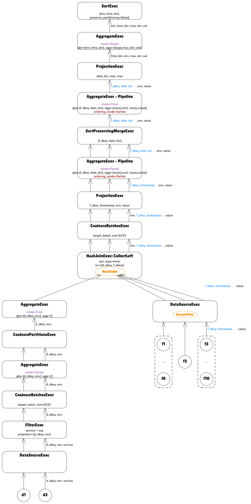
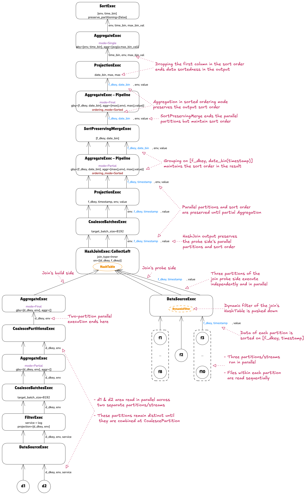

# plan-viz


[](https://www.typescriptlang.org/)
[](https://nodejs.org/)
[](LICENSE)
[](https://google.github.io/styleguide/tsguide.html)
[](https://github.com/NGA-TRAN/plan_viz/actions/workflows/ci-cd.yml)


Convert Apache DataFusion single-node and distributed physical execution plans into **Excalidraw‑JSON** for clear visualization and deeper understanding. The generated diagrams use color coding to highlight key properties and propagate them throughout the plan, making it easy to see how many streams or partitions run in parallel at each operator and whether sort order is preserved and leveraged. The visualization also pinpoints operators where parallelism or sort order is lost, helping you quickly identify bottlenecks and guide performance improvements.

**Additional advantages of using Excalidraw:**
- Edit or extend the graphical plan directly in Excalidraw, then re‑save it back to JSON
- Export the visualization to PNG or SVG for sharing in documentation, presentations, or reports
- Collaborate interactively: Excalidraw supports real‑time editing, so teams can review and annotate plans together
- Layer annotations or styling to emphasize specific operators, execution paths, or performance concerns
- Maintain a living artifact: Excalidraw files can serve as both a visualization and editable source of truth

> **Repository**: [GitHub](https://github.com/NGA-TRAN/plan_viz) | **Issues**: [Report a bug](https://github.com/NGA-TRAN/plan_viz/issues)

Distributed physical plans are supported in **v0.1.25 and later**. See the
[changelog](CHANGELOG.md) for release details.

- [Quick start](QUICKSTART.md)
- [Distributed plans and diagram conventions](#distributed-physical-plans)
- [API](#api)
- [Operator catalog](docs/operators/README.md)


## Example

### Input:

An indented EXPLAIN. You may also provide SQL or just the plan; the function automatically extracts physical operators.

Supported EXPLAIN table row labels for physical plan extraction:

- `physical_plan` — standard `EXPLAIN` output
- `Plan with Metrics` / `Plan with Full Metrics` — `EXPLAIN ANALYZE` output (includes runtime metrics)

  ```SQL
  | physical_plan | SortExec: expr=[env@0 ASC NULLS LAST, time_bin@1 ASC NULLS LAST], preserve_partitioning=[false]                                                                                                                                                                                                                                                                                                                                                                                            |
  |               |   AggregateExec: mode=Single, gby=[env@1 as env, time_bin@0 as time_bin], aggr=[avg(a.max_bin_val)]                                                                                                                                                                                                                                                                                                                                                                                        |
  |               |     ProjectionExec: expr=[date_bin(IntervalMonthDayNano("IntervalMonthDayNano { months: 0, days: 0, nanoseconds: 30000000000 }"),j.timestamp)@1 as time_bin, max(j.env)@2 as env, max(j.value)@3 as max_bin_val]                                                                                                                                                                                                                                                                           |
  |               |       AggregateExec: mode=Final, gby=[f_dkey@0 as f_dkey, date_bin(IntervalMonthDayNano("IntervalMonthDayNano { months: 0, days: 0, nanoseconds: 30000000000 }"),j.timestamp)@1 as date_bin(IntervalMonthDayNano("IntervalMonthDayNano { months: 0, days: 0, nanoseconds: 30000000000 }"),j.timestamp)], aggr=[max(j.env), max(j.value)], ordering_mode=Sorted                                                                                                                             |
  |               |         SortPreservingMergeExec: [f_dkey@0 ASC NULLS LAST, date_bin(IntervalMonthDayNano("IntervalMonthDayNano { months: 0, days: 0, nanoseconds: 30000000000 }"),j.timestamp)@1 ASC NULLS LAST]                                                                                                                                                                                                                                                                                           |
  |               |           AggregateExec: mode=Partial, gby=[f_dkey@0 as f_dkey, date_bin(IntervalMonthDayNano { months: 0, days: 0, nanoseconds: 30000000000 }, timestamp@1) as date_bin(IntervalMonthDayNano("IntervalMonthDayNano { months: 0, days: 0, nanoseconds: 30000000000 }"),j.timestamp)], aggr=[max(j.env), max(j.value)], ordering_mode=Sorted                                                                                                                                                |
  |               |             ProjectionExec: expr=[f_dkey@1 as f_dkey, timestamp@2 as timestamp, env@0 as env, value@3 as value]                                                                                                                                                                                                                                                                                                                                                                            |
  |               |               CoalesceBatchesExec: target_batch_size=8192                                                                                                                                                                                                                                                                                                                                                                                                                                  |
  |               |                 HashJoinExec: mode=CollectLeft, join_type=Inner, on=[(d_dkey@0, f_dkey@0)], projection=[env@1, f_dkey@2, timestamp@3, value@4]                                                                                                                                                                                                                                                                                                                                             |
  |               |                   AggregateExec: mode=Final, gby=[d_dkey@0 as d_dkey, env@1 as env], aggr=[]                                                                                                                                                                                                                                                                                                                                                                                               |
  |               |                     CoalescePartitionsExec                                                                                                                                                                                                                                                                                                                                                                                                                                                 |
  |               |                       AggregateExec: mode=Partial, gby=[d_dkey@0 as d_dkey, env@1 as env], aggr=[]                                                                                                                                                                                                                                                                                                                                                                                         |
  |               |                         CoalesceBatchesExec: target_batch_size=8192                                                                                                                                                                                                                                                                                                                                                                                                                        |
  |               |                           FilterExec: service@2 = log, projection=[d_dkey@0, env@1]                                                                                                                                                                                                                                                                                                                                                                                                        |
  |               |                             DataSourceExec: file_groups={2 groups: [[d1.parquet], [d2.parquet]]}, projection=[d_dkey, env, service], file_type=parquet, predicate=service@2 = log, pruning_predicate=service_null_count@2 != row_count@3 AND service_min@0 <= log AND log <= service_max@1, required_guarantees=[service in (log)] |
  |               |                   DataSourceExec: file_groups={3 groups: [[f1.parquet, f4.parquet, f5.parquet, f6.parquet, f7.parquet, f8.parquet], [f2.parquet], [f3.parquet, f9.parquet, f10.parquet]]}, projection=[f_dkey, timestamp, value], output_ordering=[f_dkey@0 ASC NULLS LAST, timestamp@1 ASC NULLS LAST], file_type=parquet, predicate=DynamicFilter [ empty ]             |
  ```

### Output

A JSON‑formatted plan that, when opened in Excalidraw, visualizes the plan as a tree.


   - **Arrows between nodes** represent streams or partitions of data. Multiple arrows indicate that data is being streamed in parallel and independently.
   - **Blue highlights** denote attributes that are sorted.

  

### Output Analysis

This section adds pink annotations to clarify the roles of arrows, circles/ellipses, and color coding. Plans are read bottom-up, and the visualization clearly shows what each operator does, how parallel execution is maintained, and how sort order is preserved and leveraged.

  

## Prerequisites

- Node.js 20+ (LTS)
- npm or yarn

## Installation

### For Development

```bash
git clone https://github.com/NGA-TRAN/plan_viz.git
cd plan_viz
npm ci
npm run build
```

### As a Package (published at https://www.npmjs.com/package/plan-viz)

```bash
npm install plan-viz
```

## Usage

### As a Library

```typescript
import { convertPlanToExcalidraw } from 'plan-viz';

const executionPlan = `
ProjectionExec: expr=[id, name, age]
  FilterExec: age > 18
    DataSourceExec: file_groups={1 groups: [[data.parquet]]}
`;

const excalidrawJson = convertPlanToExcalidraw(executionPlan);
console.log(JSON.stringify(excalidrawJson, null, 2));
```

**With Custom Configuration:**

```typescript
import { convertPlanToExcalidraw } from 'plan-viz';

const excalidrawJson = convertPlanToExcalidraw(executionPlan, {
  generator: {
    nodeWidth: 250,
    nodeHeight: 100,
    verticalSpacing: 120,
    horizontalSpacing: 60,
    operatorFontSize: 20,
    detailsFontSize: 16,
    nodeColor: '#64748b',
    arrowColor: '#64748b',
  },
});
```

**With Custom Node Generators:**

```typescript
import { convertPlanToExcalidraw } from 'plan-viz';
import { MyCustomExecGenerator } from './my-custom-exec-generator';

const excalidrawJson = convertPlanToExcalidraw(executionPlan, {
  generator: {
    customGenerators: [
      { operator: 'MyCustomExec', generator: new MyCustomExecGenerator() },
    ],
  },
});
```

Custom generators implement `NodeGeneratorStrategy`. They are registered after built-in generators, so registering the same operator key as a built-in replaces the built-in renderer for that conversion.

### Unfamiliar operators and inline wrappers

Unregistered operators can reuse the file-source, aggregate, repartition, or hash-join renderer when their properties and number of children match that renderer's contract. Their original names remain on the diagram. Exact registrations, including `customGenerators`, take precedence. Ambiguous operators get a neutral box with property summaries and their input connections.

Inline wrappers share a composite box with the inner operator:

```text
BudgetGuardExec(rows<=10000): HashJoinExec: mode=CollectLeft, join_type=Inner, on=[(id@0, id@0)]
  MeadowScanExec: file_groups={1 group: [[context.dat]]}, projection=[id]
  BufferExec: capacity=_
    BrookScanExec: file_groups={2 groups: [[points_1.dat], [points_2.dat]]}, projection=[id, value]
```

Use two spaces for each tree level, as in ordinary physical plans. Wrapper arguments stay separate from the inner properties. Long labels use bounded summaries; the parsed plan retains the full values. Large sources and partitioned hash joins show representative first/last partitions while preserving the actual stream count. Valid `output_partitioning` takes precedence over file-group count for source outputs.

`BufferExec` preserves known input metadata and displays `capacity=_` literally. Aggregate summaries show `SinglePartitioned` and `PartiallySorted` explicitly. Column names such as `@host` keep their leading `@`.

Use the same library entry point for boxed distributed plans and worker recordings. Snapshot files containing multiple sections require `input.section` or CLI `--section` (1-based). See [distributed physical plans](#distributed-physical-plans) for routing, diagnostics, and incomplete-plan behavior.

For the single-plan audit (which excludes distributed/worker sections):

```sh
npm run build
node scripts/audit-corpus.cjs /path/to/snapshots --out /path/to/report.json
```

The audit separates physical-plan sections from distributed/worker plans, logical plans, and result tables, then checks geometry, text bounds, and bindings. Add `--render-dir /path/to/scenes` to save generated Excalidraw files. Synthetic regression fixtures use invented operator names and the same two-space indentation. Use [corpus review tooling](#corpus-review-tooling) to include distributed plans, worker recordings, and upstream examples.


### As a CLI

**After global CLI installation `npm install -g plan-viz`:**

For a local installation, use `npx plan-viz`. Replace `plan.txt` with your saved physical EXPLAIN output.

```bash
# Basic usage: from file
plan-viz -i plan.txt -o output.excalidraw

# From stdin
cat plan.txt | plan-viz > output.excalidraw

# With custom dimensions and spacing
plan-viz -i plan.txt -o output.excalidraw \
  --node-width 250 \
  --node-height 100 \
  --vertical-spacing 120 \
  --horizontal-spacing 60
```

**Building from Source Code:**
```bash
# After building the project
npm run build

# Basic usage: from file
node dist/cli.js -i tests/join.sql -o output.excalidraw

# From stdin
cat tests/join.sql | node dist/cli.js > output.excalidraw

# With custom dimensions and spacing
node dist/cli.js -i tests/join.sql -o output.excalidraw \
  --node-width 250 \
  --node-height 100 \
  --vertical-spacing 120 \
  --horizontal-spacing 60
```

**CLI Options:**
- `-i, --input <file>` - Input file containing the execution plan
- `-o, --output <file>` - Output file for Excalidraw JSON
- `--section <number>` - Select a 1-based snapshot section (required when multiple sections exist)
- `--all-workers` - Draw every distributed task instead of representative tasks
- `--node-width <number>` - Width of each node box (default: 200)
- `--node-height <number>` - Height of each node box (default: 80)
- `--vertical-spacing <number>` - Vertical spacing between nodes (default: 100)
- `--horizontal-spacing <number>` - Horizontal spacing between sibling nodes (default: 50)

### Viewing (and Editing) the Output

#### Option 1: Use the UI App [plan-visualizer](https://nga-tran.github.io/plan-visualizer), customized for this library

The app is deployed separately; feature availability depends on its library version.

1. Enter your `EXPLAIN` output in the input panel
2. Click the **Visualize** button to see the graphical output

#### Option 2: Use Online [Excalidraw](https://excalidraw.com/)

1. Go to [Excalidraw](https://excalidraw.com/)
2. Click "Open" in the top menu
3. Upload your generated `.excalidraw` file
4. View your execution plan diagram!

#### Option 3: Directly in your IDE

If you use an IDE such as VSCode or Cursor, you can install the Excalidraw extension and view the diagram directly in your IDE:

1. Install the Excalidraw extension from the marketplace (e.g., "Excalidraw" by pomdtr)
2. Open your generated `.excalidraw` file in your IDE
3. The diagram will render automatically in the editor


> **Note:** The `tests/` directory serves a dual purpose:
> - **Test fixtures**: `.sql` files containing physical plans (and their SQL queries) with expected outputs in [`tests/expected/`](tests/expected/) for integration tests
> - **Examples**: `.sql` files containing physical plans you can run directly with the CLI (`plan-viz -i tests/join.sql -o output.excalidraw`) or use as input to the UI App in Option 1
>
> Distributed fixtures and their matching drawings are in [`tests/distributed/`](tests/distributed/) and [`tests/distributed/expected/`](tests/distributed/expected/).
>
> See the [`tests/`](tests/) directory for sample execution plans. Expected JSON‑formatted outputs are available in [`tests/expected/`](tests/expected/) and can be opened using Option 2 or Option 3.


## Distributed physical plans

The library function and CLI automatically recognize boxed distributed plans:

~~~sh
plan-viz --input distributed-plan.snap --output distributed-plan.excalidraw
plan-viz --input mixed-snapshots.snap --section 2 --output selected.excalidraw
plan-viz --input distributed-plan.snap --all-workers --output expanded.excalidraw
~~~

A stage is drawn as a row of task slots, with consumers above producers. Equivalent
tasks show their first and last instances by default. Blue annotations give output
partitions per operator in one task. Purple arrows bundle logical streams between
tasks and terminate at the receiving network operator; purple ellipses count omitted connections. Task slots do not identify physical
machines, and a purple bundle is not a claim about TCP connections.

Grouped gathers assign contiguous producer groups to receivers. Their network operators
show output partition capacity, assigned streams, and empty padding separately; padding
has no incoming network connection. Groups with different assigned counts remain distinct.
For grouped gathers with up to three producer tasks, all producers are shown.

DistributedLeafExec selects the source variant for the current task.
DistributedUnionExec uses a transparent background and shows active and inactive children. Its child
task context determines network routing: a three-task stage can contain a local UNION
branch and only two shuffle receivers. Unequal assignments display assigned partitions
separately from the UNION's padded output capacity.

~~~typescript
import { ConverterService } from 'plan-viz';

const result = new ConverterService({
  input: { section: 2 }, // Optional, 1-based; required for multiple snapshot sections.
  distributed: { workerDisplay: 'representative' }, // Or 'all'.
}).convertDetailed(planText);

const { scene, diagnostics } = result;
~~~

Existing convertPlanToExcalidraw() and ConverterService.convert() still return an
Excalidraw scene. ExecutionPlanParser and ExcalidrawGenerator retain their single-tree
interfaces; use PlanDocumentParser for stage-aware parsing. Custom generators remain
supported.

Complete plans support gather to one or multiple receivers, direct hash shuffle, worker-local
joins and task-specific UNION. Empty file groups retain their partition slots and appear as labeled empty groups with input arrows. Printed repartition input counts and network-gather capacity also establish upstream output counts, including custom sources, through known partition-preserving operators. Counts without sufficient evidence stay unknown. Broadcast and two-phase shuffle are supported with explicit stream multiplicity. Shuffle routing with insufficient evidence remains visibly unresolved rather than
guessed. Worker recordings without their full document render as incomplete views
with no invented inter-stage connections. Malformed complete graphs fail with a
stage/line diagnostic. Time-partition panels and physical-host placement are not inferred.

### Corpus review tooling

After building, generate an inventory and local gallery without modifying input files:

~~~sh
npm run build
npx playwright install chromium
node scripts/review-corpus.cjs \
  --upstream /path/to/datafusion-distributed \
  --connector /path/to/snapshots \
  --output tmp/corpus-review \
  --render
~~~

The script finds stored physical plans in snapshot sections, Rust inline snapshots/raw
strings, and Markdown code blocks. It records excluded sections, unsupported sketches,
conversion failures and missing runtime outputs explicitly. Each rendered entry links
to its original plan text, editable Excalidraw and PNG. PNG exports check that every
expected label was drawn; large previews are scaled to browser-safe dimensions.
Source revisions/hashes and the local converter revision/changes are recorded.
`--connector` accepts any directory of saved connector plans.
Use `--fixtures tests/distributed` to include the public distributed fixtures, and
`--runtime /path/to/captured/snapshots` for additional locally captured plans.

Create the thumbnail overview and run the browser editability checks with:

~~~sh
node scripts/corpus-contact-sheets.cjs tmp/corpus-review
node scripts/verify-distributed.cjs
node scripts/audit-upstream-operators.cjs /path/to/datafusion-distributed
~~~

The inventory audit requires the pinned upstream revision documented in the operator audit.
Local corpus galleries belong in ignored directories such as `tmp/`.

The browser checks exercise worker-group dragging, individual operator dragging and
network bindings in the actual Excalidraw editor, plus CLI section/error handling.

See the [Distributed DataFusion operator audit](docs/operators/distributed-datafusion.md) for source references, execution contracts, coverage, and metadata limitations.

## API

#### `convertPlanToExcalidraw(plan: string, config?: ConverterConfig): ExcalidrawData`

Converts a single or distributed physical plan into Excalidraw-compatible JSON. This convenience function returns the scene; use `ConverterService.convertDetailed()` to inspect the selected document and diagnostics.

**Parameters:**
- `plan` - The physical execution plan as a string
- `config` - Optional configuration object (see below)

**Returns:**
- `ExcalidrawData` - Excalidraw-compatible JSON object

**Throws:**
- `Error` - If the input is empty, the section selection is missing/invalid, parsing fails, or a complete distributed graph violates its contracts

**Configuration Options:**

```typescript
interface ConverterConfig {
  input?: { section?: number }; // 1-based snapshot section
  distributed?: { workerDisplay?: 'representative' | 'all' };
  parser?: {
    indentationSize?: number;      // Default: 2
    extractProperties?: boolean;    // Default: true
  };
  generator?: {
    nodeWidth?: number;               // Default: 200
    nodeHeight?: number;              // Default: 80
    verticalSpacing?: number;         // Default: 100
    horizontalSpacing?: number;       // Default: 50
    fontSize?: number;                // Default: 16; base for derived font sizes
    operatorFontSize?: number;        // Default: 20 (for operator name)
    detailsFontSize?: number;         // Default: 14 (for properties/details)
    nodeColor?: string;               // Default: '#1e1e1e'
    arrowColor?: string;              // Default: '#1e1e1e'
    customGenerators?: Array<{
      operator: string;
      generator: NodeGeneratorStrategy;
    }>;
  };
}
```

**Example:**

```typescript
import { convertPlanToExcalidraw } from 'plan-viz';

const plan = `
ProjectionExec: expr=[id, name, age]
  FilterExec: age > 18
    DataSourceExec: file_groups={1 groups: [[data.parquet]]}
`;

const result = convertPlanToExcalidraw(plan, {
  generator: {
    nodeWidth: 250,
    nodeHeight: 100,
    nodeColor: '#64748b',
  },
});
```

### Detailed conversion and parsing

```typescript
import { ConverterService, PlanDocumentParser } from 'plan-viz';

const result = new ConverterService({
  distributed: { workerDisplay: 'all' },
}).convertDetailed(executionPlan);

// result.scene: ExcalidrawData
// result.document.kind: 'single' | 'distributed' | 'recorded'
// result.diagnostics: Array<{ code: string; message: string; node?: string }>

const document = new PlanDocumentParser().parse(executionPlan);
```

`convertDetailed()` exposes incomplete topology, unknown counts, and unresolved
routing for distributed/recorded documents. Single-tree conversions currently
return an empty diagnostics list. `ConverterService.convert()` returns only the
scene, like `convertPlanToExcalidraw()`.

`PlanDocumentParser.parse(text, section?)` accepts the same 1-based section
selection. `ExecutionPlanParser.parse()` and `ExcalidrawGenerator.generate()`
remain available for a single operator tree.

Dimensions and fonts are layout defaults; specialized renderers and label fitting
may increase box sizes or use operator-specific settings.

## Examples

The project includes numerous example execution plans in the [`tests/`](tests/) directory, including:

- Data source plans (`dataSource*.sql`)
- Filter operations (`filter*.sql`)
- Repartitioning (`repartition*.sql`)
- Aggregation examples (`*aggregate*.sql`)
- Projection (`*projection*.sql`)
- Join operations (`join*.sql`, `join_hash_collectLeft.sql`, `join_hash_partitioned.sql`, `join_sort_merge*.sql`, `join_nested_loop.sql`, `join_symmetric_hash.sql`, `join_piecewise_merge.sql`)
- TPC-H physical plans from Apache DataFusion (`tpch_q3.sql`, `tpch_q5.sql`, `tpch_q9.sql`, `tpch_q11.sql`, `tpch_q21.sql`)
- Window functions (`window_agg*.sql`, `window_bounded*.sql`, `window_streaming_unbounded.sql`)
- Unnest (`unnest_basic.sql`)
- Sorting (`sort*.sql`)
- Union / interleave (`union*.sql`, `interleave_2_inputs.sql`)
- Analyze / empty / placeholder / memory leaves (`analyze_basic.sql`, `empty_basic.sql`, `placeholder_row_basic.sql`, `memory_lazy_4.sql`)
- Wave D (`explain_basic.sql`, `streaming_basic.sql`, `work_table_basic.sql`, `buffer_basic.sql`, `cooperative_basic.sql`, `sink_basic.sql`, `recursive_basic.sql`, `recursive_cte_trans.sql`, `scalar_subquery_basic.sql`, `subquery_two_scalars.sql`, `subquery_nested.sql`)
- Distributed gather, grouped gather, broadcast, direct/two-phase shuffle, joins, task-specific UNION, and legacy isolation ([fixtures](tests/distributed/), [expected drawings](tests/distributed/expected/)).

> **Note:** The `tests/` directory serves a dual purpose: test fixtures and examples

Each example includes:
- A `.sql` file with the execution plan (in `tests/`)
- A matching `.excalidraw` file in the adjacent `expected/` directory (`tests/expected/` or `tests/distributed/expected/`)

Try them out:

```bash
# Convert an example (after building)
npm run build
node dist/cli.js -i tests/join.sql -o output.excalidraw

# Convert a distributed example
node dist/cli.js -i tests/distributed/broadcast_three_to_two.sql -o broadcast.excalidraw
```

## Development

```bash
# Install locked development dependencies
npm ci

# Build
npm run build

# Run tests
npm test

# Run tests with coverage
npm run test:coverage

# Lint
npm run lint

# Format
npm run format
```

## Project Structure

See [PROJECT_STRUCTURE.md](docs/PROJECT_STRUCTURE.md) for detailed project organization.

## Architecture

See [ARCHITECTURE.md](docs/ARCHITECTURE.md) for the current conversion pipeline:
section selection and parsing, task/count/routing analysis, operator strategies,
and stage composition. [PROJECT_OVERVIEW.md](docs/PROJECT_OVERVIEW.md) provides a
short documentation map.

## Testing

```bash
# Run all tests
npm test

# Watch mode
npm run test:watch

# Coverage report
npm run test:coverage
```

Jest enforces at least 80% global coverage for branches, functions, lines, and
statements. Integration tests compare normalized scenes and text bindings against
checked-in expected drawings in both fixture directories. Run the coverage command
for current results; see [corpus review tooling](#corpus-review-tooling) for browser and gallery checks.

## Code Quality

- **Linting**: ESLint with Google TypeScript style guide
- **Formatting**: Prettier
- **Type Safety**: Strict TypeScript configuration
- **Testing**: Jest with comprehensive test suites

## Contributing

We welcome contributions! Please see [CONTRIBUTING.md](CONTRIBUTING.md) for details.

```bash
# Use commitizen for commits
npm run commit
```

### Commit Convention

This project uses [Conventional Commits](https://www.conventionalcommits.org/):

- `feat:` - New features
- `fix:` - Bug fixes
- `docs:` - Documentation changes
- `test:` - Test updates
- `refactor:` - Code refactoring

## Roadmap

- [X] Interactive web interface: [plan-visualizer](https://nga-tran.github.io/plan-visualizer) — try it out!
- [X] Support for additional DataFusion operators (Waves A–D; see [operator catalog](./docs/operators/README.md))
- [X] Support [Distributed DataFusion](https://github.com/datafusion-contrib/datafusion-distributed) physical plans
- [ ] Enhanced options for custom styling
- [ ] Performance optimizations for large plans

## Resources

- [Apache DataFusion](https://arrow.apache.org/datafusion/)
- [Excalidraw API](https://docs.excalidraw.com/docs/@excalidraw/excalidraw/api)
- [Google TypeScript Style Guide](https://google.github.io/styleguide/tsguide.html)
- [Quick Start Guide](QUICKSTART.md) - Get started quickly
- [Project Overview](docs/PROJECT_OVERVIEW.md) - Detailed architecture and design

## License

MIT - see [LICENSE](LICENSE) for details

## Authors

Created with ❤️ for the Apache DataFusion community

## Changelog

See [CHANGELOG.md](CHANGELOG.md) for a detailed history of changes.
