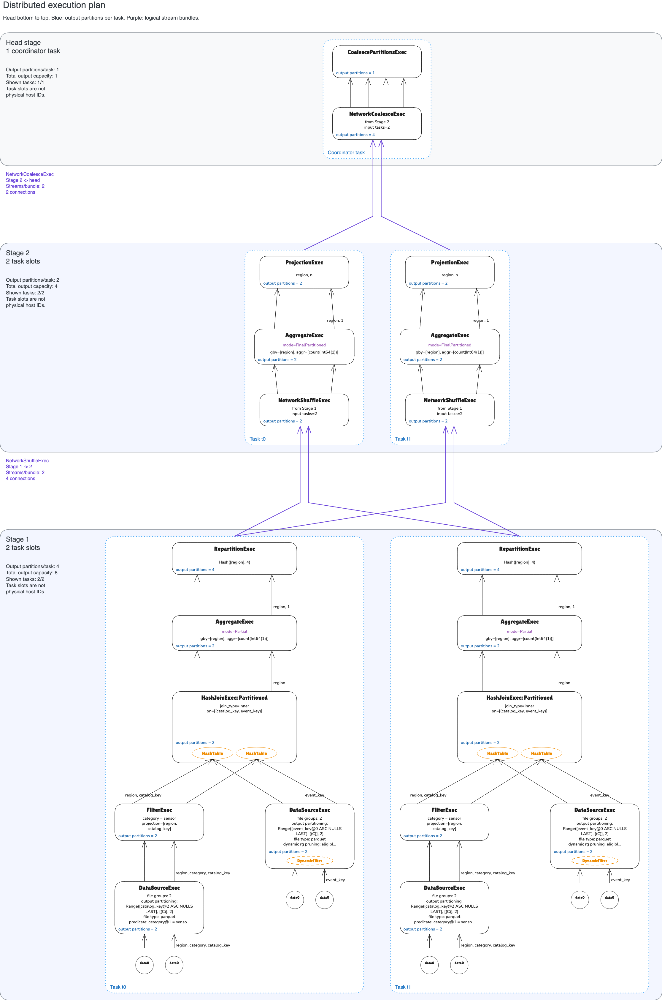

# plan-viz

[](https://www.typescriptlang.org/)
[](https://nodejs.org/)
[](LICENSE)
[](https://google.github.io/styleguide/tsguide.html)
[](https://github.com/NGA-TRAN/plan_viz/actions/workflows/ci-cd.yml)

Convert Apache DataFusion physical EXPLAIN plans into editable **Excalidraw diagrams**.
See operators, parallel streams, sort order, and distributed data flow at a glance.

[Install](#installation) · [Usage](#usage) · [Documentation](#documentation) · [Issues](https://github.com/NGA-TRAN/plan_viz/issues)

## Single-node plans

Read diagrams from bottom to top. Arrows represent partition streams; blue column
labels mark known sort order. This example combines a join, aggregation, and sorting.

<details open>
<summary>Text plan</summary>

```text
SortExec: expr=[env@0 ASC NULLS LAST, time_bin@1 ASC NULLS LAST], preserve_partitioning=[false]
  AggregateExec: mode=Single, gby=[env@1 as env, time_bin@0 as time_bin], aggr=[avg(a.max_bin_val)]
    ProjectionExec: expr=[date_bin(IntervalMonthDayNano("IntervalMonthDayNano { months: 0, days: 0, nanoseconds: 30000000000 }"),j.timestamp)@1 as time_bin, max(j.env)@2 as env, max(j.value)@3 as max_bin_val]
      AggregateExec: mode=Final, gby=[f_dkey@0 as f_dkey, date_bin(IntervalMonthDayNano("IntervalMonthDayNano { months: 0, days: 0, nanoseconds: 30000000000 }"),j.timestamp)@1 as date_bin(IntervalMonthDayNano("IntervalMonthDayNano { months: 0, days: 0, nanoseconds: 30000000000 }"),j.timestamp)], aggr=[max(j.env), max(j.value)], ordering_mode=Sorted
        SortPreservingMergeExec: [f_dkey@0 ASC NULLS LAST, date_bin(IntervalMonthDayNano("IntervalMonthDayNano { months: 0, days: 0, nanoseconds: 30000000000 }"),j.timestamp)@1 ASC NULLS LAST]
          AggregateExec: mode=Partial, gby=[f_dkey@0 as f_dkey, date_bin(IntervalMonthDayNano { months: 0, days: 0, nanoseconds: 30000000000 }, timestamp@1) as date_bin(IntervalMonthDayNano("IntervalMonthDayNano { months: 0, days: 0, nanoseconds: 30000000000 }"),j.timestamp)], aggr=[max(j.env), max(j.value)], ordering_mode=Sorted
            ProjectionExec: expr=[f_dkey@1 as f_dkey, timestamp@2 as timestamp, env@0 as env, value@3 as value]
              CoalesceBatchesExec: target_batch_size=8192
                HashJoinExec: mode=CollectLeft, join_type=Inner, on=[(d_dkey@0, f_dkey@0)], projection=[env@1, f_dkey@2, timestamp@3, value@4]
                  AggregateExec: mode=Final, gby=[d_dkey@0 as d_dkey, env@1 as env], aggr=[]
                    CoalescePartitionsExec
                      AggregateExec: mode=Partial, gby=[d_dkey@0 as d_dkey, env@1 as env], aggr=[]
                        CoalesceBatchesExec: target_batch_size=8192
                          FilterExec: service@2 = log, projection=[d_dkey@0, env@1]
                            DataSourceExec: file_groups={2 groups: [[d1.parquet], [d2.parquet]]}, projection=[d_dkey, env, service], file_type=parquet, predicate=service@2 = log, pruning_predicate=service_null_count@2 != row_count@3 AND service_min@0 <= log AND log <= service_max@1, required_guarantees=[service in (log)]
                  DataSourceExec: file_groups={3 groups: [[f1.parquet, f4.parquet, f5.parquet, f6.parquet, f7.parquet, f8.parquet], [f2.parquet], [f3.parquet, f9.parquet, f10.parquet]]}, projection=[f_dkey, timestamp, value], output_ordering=[f_dkey@0 ASC NULLS LAST, timestamp@1 ASC NULLS LAST], file_type=parquet, predicate=DynamicFilter [ empty ]
```

</details>


[Plan text](docs/assets/join-aggregates.txt) · [SQL and EXPLAIN](tests/join_aggregates.sql) · [Editable Excalidraw](tests/expected/join_aggregates.excalidraw) · [Annotated diagram](docs/assets/join_aggregates_with_analyses.png)

<details>
<summary>How to read the plan</summary>

The pink annotations explain the arrows, file groups, hash tables, and sort-order
highlights. Follow the streams from the sources at the bottom toward the result
at the top to see where operators preserve or reduce parallelism.


</details>

## Distributed physical plans

Stages appear as rows, with consumers above producers. Blue badges show output
partitions per task. Purple arrows bundle streams between tasks and connect to the
receiving network operator. Ellipses mark omitted tasks or connections; task slots
do not represent physical machines.

Equivalent tasks show their first and last instances by default; this example has
two tasks per stage, so both are shown. Use `--all-workers` to draw every task in
larger plans. See [distributed conventions and limits](docs/DISTRIBUTED_PLANS.md).

### Range-partitioned join with dynamic filtering

Two tasks join range-partitioned catalog and event inputs, with dynamic filters
on the event scans. They partially aggregate counts by region, then hash-shuffle
the results to two final aggregation tasks. The coordinator gathers their four
output streams and coalesces them into one.

<details open>
<summary>Text plan</summary>

```text
┌───── DistributedExec
│ CoalescePartitionsExec
│   [Stage 2] => NetworkCoalesceExec: output_partitions=4, input_tasks=2
└──────────────────────────────────────────────────
  ┌───── Stage 2 ── tasks=2, partitions=2
  │ ProjectionExec: expr=[region@0 as region, count(Int64(1))@1 as n]
  │   AggregateExec: mode=FinalPartitioned, gby=[region@0 as region], aggr=[count(Int64(1))]
  │     [Stage 1] => NetworkShuffleExec: output_partitions=2, input_tasks=2
  └──────────────────────────────────────────────────
    ┌───── Stage 1 ── tasks=2, partitions=4
    │ RepartitionExec: partitioning=Hash([region@0], 4), input_partitions=2
    │   AggregateExec: mode=Partial, gby=[region@0 as region], aggr=[count(Int64(1))]
    │     HashJoinExec: mode=Partitioned, join_type=Inner, on=[(catalog_key@1, event_key@0)], projection=[region@0]
    │       FilterExec: category@1 = sensor, projection=[region@0, catalog_key@2]
    │         DistributedLeafExec:
    │           t0: DataSourceExec: file_groups={2 groups: [[fixtures/catalog/catalog_key=A/data0.parquet], [fixtures/catalog/catalog_key=C/data0.parquet]]}, projection=[region, category, catalog_key], output_partitioning=Range([catalog_key@2 ASC NULLS LAST], [(C)], 2), file_type=parquet, predicate=category@1 = sensor, pruning_predicate=category_null_count@2 != row_count@3 AND category_min@0 <= sensor AND sensor <= category_max@1, required_guarantees=[category in (sensor)]
    │           t1: DataSourceExec: file_groups={2 groups: [[fixtures/catalog/catalog_key=B/data0.parquet], [fixtures/catalog/catalog_key=D/data0.parquet]]}, projection=[region, category, catalog_key], output_partitioning=Range([catalog_key@2 ASC NULLS LAST], [(C)], 2), file_type=parquet, predicate=category@1 = sensor, pruning_predicate=category_null_count@2 != row_count@3 AND category_min@0 <= sensor AND sensor <= category_max@1, required_guarantees=[category in (sensor)]
    │       DistributedLeafExec:
    │         t0: DataSourceExec: file_groups={2 groups: [[fixtures/events/event_key=A/data0.parquet], [fixtures/events/event_key=C/data0.parquet]]}, projection=[event_key], output_partitioning=Range([event_key@0 ASC NULLS LAST], [(C)], 2), file_type=parquet, predicate=DynamicFilter [ event_key@2 >= A AND event_key@2 <= A AND event_key@2 IN (SET) ([<values>]) ], dynamic_rg_pruning=eligible, pruning_predicate=event_key_null_count@1 != row_count@2 AND event_key_max@0 >= A AND event_key_null_count@1 != row_count@2 AND event_key_min@3 <= A AND event_key_null_count@1 != row_count@2 AND event_key_min@3 <= A AND A <= event_key_max@0, required_guarantees=[event_key in (A)]
    │         t1: DataSourceExec: file_groups={2 groups: [[fixtures/events/event_key=B/data0.parquet], [fixtures/events/event_key=D/data0.parquet]]}, projection=[event_key], output_partitioning=Range([event_key@0 ASC NULLS LAST], [(C)], 2), file_type=parquet, predicate=DynamicFilter [ event_key@2 >= B AND event_key@2 <= B AND event_key@2 IN (SET) ([<values>]) ], dynamic_rg_pruning=eligible, pruning_predicate=event_key_null_count@1 != row_count@2 AND event_key_max@0 >= B AND event_key_null_count@1 != row_count@2 AND event_key_min@3 <= B AND event_key_null_count@1 != row_count@2 AND event_key_min@3 <= B AND B <= event_key_max@0, required_guarantees=[event_key in (B)]
    └──────────────────────────────────────────────────
```

</details>



[Plan text](tests/distributed/dynamic_filter_range_join.sql) · [Full-size diagram](docs/assets/distributed-dynamic-filter-range-join.png) · [Editable Excalidraw](tests/distributed/expected/dynamic_filter_range_join.excalidraw)

## Custom and unfamiliar operators

Operators with unfamiliar names can reuse source, aggregate, repartition, or join
renderers when their properties and child counts match. Their original names remain
visible; unmatched operators get neutral boxes with their inputs connected.

```text
FilterExec: value@1 > 100
  MeadowScanExec: file_groups={2 groups: [[a.parquet], [b.parquet]]}, projection=[id, value], file_type=parquet
```

Here `MeadowScanExec` uses the file-source renderer automatically. No registration
or extra installation is needed. Inline wrappers are also supported. For a custom
appearance, register a `NodeGeneratorStrategy` through the library's
`customGenerators` option; see the [custom-operator guide](docs/CUSTOM_OPERATORS.md).

## Prerequisites

Node.js **20+** and npm. Distributed support requires **plan-viz 0.1.25+**.

## Installation

One package supports single-node plans, distributed plans, and custom operators:

```sh
npm install plan-viz
```

For building from source or contributing, see [development setup](CONTRIBUTING.md#setup).

## Usage

### CLI

Save your physical EXPLAIN output as `plan.txt`, then run:

```sh
npx plan-viz -i plan.txt -o output.excalidraw
```

The plan format is detected automatically. For snapshot files with multiple sections,
add `--section 2` (1-based). See [all CLI options](docs/CLI.md).

### Library

```javascript
const { readFileSync, writeFileSync } = require('node:fs');
const { convertPlanToExcalidraw } = require('plan-viz');

const plan = readFileSync('plan.txt', 'utf8');
const scene = convertPlanToExcalidraw(plan);
writeFileSync('output.excalidraw', JSON.stringify(scene, null, 2));
```

The same function accepts single-node and distributed plans. Use
`ConverterService.convertDetailed()` for diagnostics; see the [API reference](docs/API.md).

### View and edit

Open `output.excalidraw` in [Excalidraw](https://excalidraw.com/) or an IDE Excalidraw
extension. Edit the diagram, annotate it, or export PNG/SVG for sharing.

You can also paste plan text into the [plan-visualizer web app](https://nga-tran.github.io/plan-visualizer).
Its supported features depend on the library version deployed there.

## Documentation

| Guide | Contents |
|---|---|
| [Quick start](QUICKSTART.md) | Install or build, convert, and open a drawing |
| [API](docs/API.md) / [CLI](docs/CLI.md) | Configuration, input formats, diagnostics, and options |
| [Distributed plans](docs/DISTRIBUTED_PLANS.md) | Task/stream conventions, routing, and limitations |
| [Custom operators](docs/CUSTOM_OPERATORS.md) | Automatic inference, wrappers, and custom renderers |
| [Operator catalog](docs/operators/README.md) | Supported operators and execution contracts |
| [Corpus review](docs/CORPUS_REVIEW.md) | Inventory and render collections of saved plans |
| [Architecture](docs/ARCHITECTURE.md) / [Project structure](docs/PROJECT_STRUCTURE.md) | Internals and source layout |

More examples: [single-node fixtures](tests/) and [distributed fixtures](tests/distributed/),
with editable drawings in [tests/expected](tests/expected/) and
[tests/distributed/expected](tests/distributed/expected/).

## Contributing

See [CONTRIBUTING.md](CONTRIBUTING.md) for setup, tests, visual review, commits, and releases.

[MIT license](LICENSE) · [Changelog](CHANGELOG.md) · [GitHub](https://github.com/NGA-TRAN/plan_viz)
