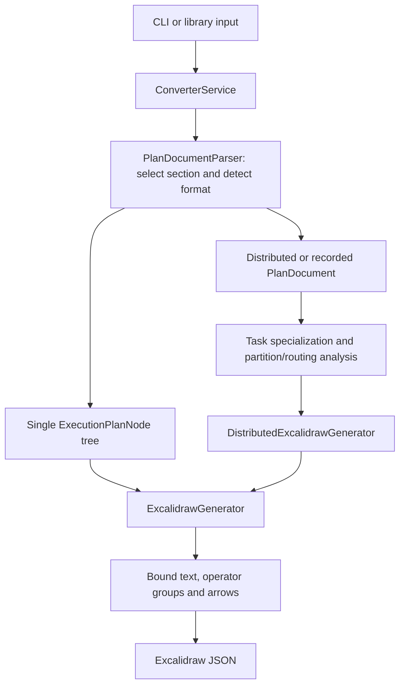

# Architecture

plan-viz converts physical EXPLAIN text into an editable Excalidraw scene. The
conversion path separates parsing, distributed execution analysis, and drawing.
This document describes the current source tree; release history is in
[CHANGELOG.md](../CHANGELOG.md).

## Conversion flow

## Public interfaces

- `convertPlanToExcalidraw(text, config?)` and `ConverterService.convert(text)`
  return `ExcalidrawData` for single or distributed plans.
- `ConverterService.convertDetailed(text)` returns `{ scene, document, diagnostics }`.
- `PlanDocumentParser.parse(text, section?)` returns a document whose `kind` is
  `single`, `distributed`, or `recorded`.
- `ExecutionPlanParser` and `ExcalidrawGenerator` remain available for callers
  that already have a single operator tree.
- The CLI reads a file or stdin, writes a scene to a file or stdout, and reports
  conversion diagnostics on stderr. `--section` selects a 1-based snapshot
  section; `--all-workers` expands representative task groups.

See [the API reference](../README.md#api) for configuration and return values.
The service constructs its parsers and generators internally. It does not expose
an injectable parser or an alternate-output-format interface.

## Parsing

`PlanDocumentParser` removes snapshot front matter, splits `##`/`###` sections,
requires an explicit selection when more than one section exists, and extracts
physical EXPLAIN table rows. Supported row labels are `physical_plan`,
`Plan with Metrics`, and `Plan with Full Metrics`.

`ExecutionPlanParser` builds the indented operator tree. It preserves original
operator names, nested/quoted property values, and inline wrappers. The default
indentation is two spaces. The lower-level parser handles one tree; distributed
input goes through `PlanDocumentParser` and `DistributedPlanParser`.

`DistributedPlanParser` reads boxed stages, task counts, source variants, UNION
assignments, and network stage references. `PlanNode` extends the ordinary node
with source location, identity, task context, and network-boundary metadata.
Worker/planner recordings retain an incomplete document instead of inventing
missing stages or task identities.

## Distributed analysis

The modules in `src/analysis/` establish execution facts before layout:

| Module | Responsibility |
|---|---|
| `operator-contracts.ts` | Infer source, aggregate, repartition, and hash-join families from properties and arity, independent of vendor names |
| `task-specializer.ts` | Select DistributedLeaf variants and active DistributedUnion branches using the effective task context |
| `partition-analysis.ts` | Compute logical output capacity, evidence, assigned streams, and padding; refine unknown counts from consumer metadata through known preserving operators |
| `distributed-analysis.ts` | Validate the stage graph, resolve network producer/consumer pairs and stream multiplicity, and group equivalent task plans |

Counts describe advertised logical capacity, including empty partitions. They are
independent of the number of arrows drawn. A consumer hint cannot overwrite a
known local count, and an unknown unary contract stops backward inference.

Network analysis supports gather, balanced grouped gather, broadcast, direct
shuffle, and two-phase shuffle. Effective UNION child contexts determine routing.
The exact formulas, source references, and metadata limits are in the
[Distributed DataFusion audit](operators/distributed-datafusion.md).

Malformed complete graphs fail with contextual errors. Insufficient metadata
produces structured diagnostics and visible unknown counts or unresolved routes.
Single-tree conversion currently returns an empty diagnostics list; a neutral
fallback box by itself is not a distributed analysis warning.

## Rendering

`ExcalidrawGenerator` recursively resolves each node to a strategy. Exact
registrations, including custom generators, take precedence over structural
inference. An unmatched node uses a neutral box with property summaries and
input connections. `UpstreamNodeGenerator` shares that visual style while using
audited public operator count contracts.

Each strategy receives a `GenerationContext` containing element factories,
layout/property helpers, configuration, optional partition counts, and a
recursive child-generation callback. Its `NodeInfo` carries geometry, connection
positions, logical stream count, columns, and sort information.

The tree generator fits labels, aligns unary chains, packs subtrees, renders
inline-wrapper panels, and adds omission markers for compacted partitions.
Text bindings and operator groups keep labels attached during Excalidraw export
and editing. Arrow bindings are rebuilt when geometry moves.

`DistributedExcalidrawGenerator` renders specialized task trees in stage rows,
with consumers above producers. Equivalent tasks show first and last instances
by default; `workerDisplay: 'all'` shows every task. Small grouped gathers show
all producer tasks when there are at most three. Blue badges report per-task
capacity, assignments, and padding. Purple arrows bundle logical streams and
terminate at the specific receiving network operator. Padding creates no
network connection. Task slots do not represent physical hosts or TCP sockets.

## Shared drawing components

- `ElementFactory` creates scene elements with consistent properties.
- Property, text-measurement, geometry, and arrow helpers support node strategies.
- `ColumnLabelRenderer` highlights known sorted columns.
- `DetailTextBuilder` creates colored detail lines.
- Adaptive layout, scene composition, text binding, arrow binding, and partition
  omission utilities handle the final scene and its editability.

## Extending support

Use `generator.customGenerators` for a custom `NodeGeneratorStrategy` or a
built-in override. New built-in support may also need a parser rule, a partition
contract, or task/network analysis; registering a renderer alone does not
establish execution semantics. See [the operator workflow](operators/WORKFLOW.md).

The distributed renderer registers its network and UNION renderers before user
customizations. A custom network renderer must expose its operator rectangle so
network arrows can bind to it. Custom renderers do not automatically supply new
partition or routing contracts.

## Tests and build boundaries

- Unit tests cover parsing, count inference, routing, geometry, and bindings.
- `tests/integration.test.ts` compares normalized scenes with expected files for
  both `tests/*.sql` and `tests/distributed/*.sql`, and checks fixture pairing.
- `scripts/verify-distributed.cjs` checks CLI behavior and actual Excalidraw
  worker/operator/network-input dragging through Playwright.
- Corpus tooling validates geometry and label exports for stored external plans;
  detailed visual review remains necessary for large drawings.
- Jest enforces 80% global coverage for statements, branches, functions, and lines.
- `tsconfig.build.json` excludes tests and test helpers from `dist/`. Browser
  export/editing dependencies are development-only; Commander is the runtime
  dependency. The npm package includes `dist`, README, and LICENSE alongside
  package metadata.

Large plans can expand into many task trees and network pairs. Representative
views reduce visible elements, but parsing and analysis still process task
contexts. There is no streaming conversion or general linear-time guarantee.
